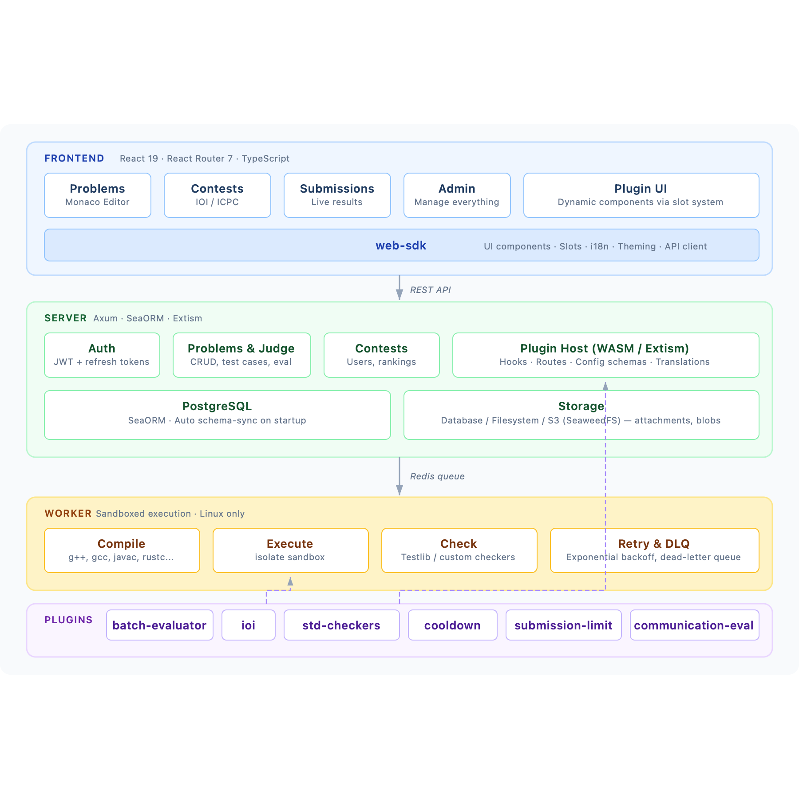

# Broccoli

A plugin-based online judge system for competitive programming. Supports
multiple contest formats (IOI, ICPC), sandboxed code execution, and a WASM
plugin architecture for extensibility.

## Architecture



## Project Structure

```
broccoli/
├── packages/
│   ├── server/         # API server (Axum, SeaORM, Extism plugin host)
│   ├── worker/         # Sandboxed judge worker (compile, run, check)
│   ├── web/            # Frontend (React 19, React Router 7, Monaco Editor)
│   ├── web-sdk/        # Frontend SDK (UI components, plugin slots, i18n, theming)
│   ├── common/         # Shared Rust types (verdicts, statuses, storage, hooks)
│   ├── mq/             # Redis message queue abstraction
│   ├── plugin-core/    # Plugin runtime, registry, manifest parsing
│   ├── server-sdk/     # SDK for writing WASM plugins (guest-side)
│   └── cli/            # CLI tool: scaffold, build, and watch plugins
├── plugins/
│   ├── batch-evaluator/          # Standard compile → run → check pipeline
│   ├── ioi/                      # IOI contest format (subtasks, tokens, scoreboard)
│   ├── standard-checkers/        # Output comparison: exact, ignore whitespace, etc.
│   ├── communication-evaluator/  # Interactive problems (manager + contestant via FIFOs)
│   ├── cooldown/                 # Minimum delay between submissions
│   ├── submission-limit/         # Max submissions per task
│   ├── config-ui-test/           # Stress-test plugin for the config UI
│   └── broccoli-zh-cn/           # Chinese translation pack (git submodule)
├── config/
│   └── config.example.toml       # Example configuration
├── docker-compose.yaml           # PostgreSQL, Redis, SeaweedFS
└── Justfile                      # Task runner recipes
```

## Prerequisites

- **Rust** nightly (with `wasm32-wasip1` target for plugins)
- **Node.js** 24+ and **pnpm** 10+
- **Docker** (for PostgreSQL, Redis, SeaweedFS)
- **just** — task runner (`brew install just`)
- **isolate** — sandbox for the worker (Linux only; the worker cannot run on
  macOS)

## Quick Start

```bash
# 1. Start infrastructure (PostgreSQL, Redis, SeaweedFS)
just up

# 2. Copy and edit configuration
cp config/config.example.toml config/config.toml

# 3. Install JS dependencies and build frontend SDK
just install
just build-js

# 4. Build WASM plugins
just build-plugins --install

# 5. Clone git submodules (broccoli-zh-cn translation pack)
git submodule update --init

# 6. Run the server (auto-syncs DB schema on startup)
just server

# 7. Run the frontend dev server (separate terminal)
just dev-web
```

The server runs at `http://127.0.0.1:3000`. The frontend dev server runs at
`http://localhost:5173`.

## Development

```bash
just server              # Run API server
just worker              # Run judge worker (Linux only)
just dev-web             # Frontend dev server with HMR
just dev                 # All JS packages in parallel dev mode

just build               # Build all Rust crates
just build-js            # Build all JS packages
just build-plugins --install   # Build all WASM plugins (debug)
just build-plugins-release     # Build all WASM plugins (optimized)
just build-plugin plugins/ioi --install  # Build a single plugin

just test                # Run all Rust tests
just clippy              # Lint Rust code
just lint-js             # ESLint
just format-check        # Prettier check
just check-all           # All of the above
```

## Configuration

Copy `config/config.example.toml` to `config/config.toml`. Key sections:

| Section         | Purpose                                                                 |
| --------------- | ----------------------------------------------------------------------- |
| `[server]`      | Host, port, CORS origins                                                |
| `[database]`    | PostgreSQL connection URL                                               |
| `[auth]`        | JWT secret                                                              |
| `[mq]`          | Redis URL, queue names, DLQ retry policy                                |
| `[storage]`     | Backend (`database`, `filesystem`, or `object_storage`) and S3 settings |
| `[worker]`      | Sandbox backend (`isolate`), cgroups toggle                             |
| `[plugin]`      | Plugins directory, WASI toggle                                          |
| `[languages.*]` | Compiler/interpreter paths, file naming templates                       |

Environment variables can override config via `BROCCOLI__` prefix (e.g.,
`BROCCOLI__DATABASE__URL`).

## Plugin System

Plugins are WASM modules (compiled from Rust via Extism) that extend both the
server and the frontend.

### Plugin Capabilities

A plugin can:

- **Register hooks** — intercept submission lifecycle events
  (`before_submission`, `after_judging`)
- **Define HTTP routes** — served under `/api/plugins/{id}/...`
- **Declare config schemas** — rendered as forms in the admin UI, scoped to
  plugin/problem/contest/contest-problem
- **Provide translations** — per-locale TOML files merged into the i18n system
- **Export frontend components** — React components loaded dynamically into the
  web app's slot system
- **Access host APIs** — database queries, storage, task dispatch, checker
  execution, language config

### Creating a Plugin

```bash
# Scaffold a new plugin
cargo run -p broccoli-cli -- plugin new my-plugin

# Build and install it
just build-plugin plugins/my-plugin --install
```

Each plugin has a `plugin.toml` manifest defining its server entry, hooks,
routes, config schemas, translations, and web components. See any existing
plugin in `plugins/` for examples.

### Frontend Slot System

The web-sdk provides a `<Slot>` component for plugin UI injection. Plugins
declare which slots they target and how (replace, wrap, prepend, append, before,
after):

```toml
# In plugin.toml
[[web.slots]]
name = "config.field.my-plugin.settings.mode"
position = "replace"
component = "ModeSelector"
```

## Tech Stack

**Backend** — Rust: Axum, SeaORM (PostgreSQL), Extism (WASM), Redis
(broccoli_queue), Argon2 (auth), utoipa (OpenAPI)

**Frontend** — TypeScript: React 19, React Router 7, Tailwind CSS, Radix UI,
Monaco Editor, TanStack Query, Vite

**Infrastructure** — PostgreSQL 18, Redis 7, SeaweedFS (S3-compatible object
storage), isolate (Linux sandbox)

## Docker Services

```bash
just up    # Start services
just down  # Stop services
```

| Service    | Port                     | Purpose        |
| ---------- | ------------------------ | -------------- |
| PostgreSQL | 5432                     | Database       |
| Redis      | 6379                     | Message queue  |
| SeaweedFS  | 8333 (S3), 9333 (master) | Object storage |

Credentials are configured via `.env` file (see `docker-compose.yaml`).

## API Documentation

When the server is running, interactive API docs are available at:

- **Swagger UI** — `http://127.0.0.1:3000/swagger-ui`
- **Scalar** — `http://127.0.0.1:3000/scalar`

## License

MIT
