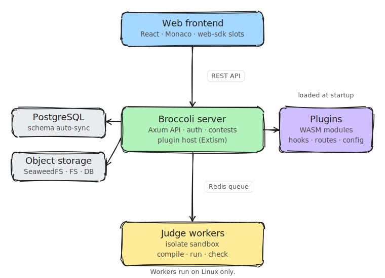

# Broccoli

A plugin-based online judge for competitive programming. Broccoli runs contests
in IOI and ICPC formats, judges submissions in a sandbox, and extends both the
server and the web frontend through WebAssembly plugins.

Operator release and deployment instructions live in
[`docs/release.md`](docs/release.md).

## Architecture

<picture>
  <source media="(prefers-color-scheme: dark)" srcset="website/static/img/architecture.dark.svg">
  
</picture>

The web frontend talks to the server over a REST API. The server owns all state,
runs plugins as sandboxed WASM modules, and hands judging work to workers over a
Redis queue. Workers compile, run, and check submissions inside an isolate
sandbox, so they run on Linux only.

## Project structure

```
broccoli/
├── packages/
│   ├── server/         # HTTP/API server (Axum, SeaORM, Extism plugin host)
│   ├── worker/         # Judge worker: compile, run, check (Linux only)
│   ├── web/            # Web frontend (React 19, React Router 7, Monaco)
│   ├── web-sdk/        # Frontend SDK: UI kit, plugin slots, i18n, theming
│   ├── server-sdk/     # Rust SDK for writing backend WASM plugins
│   ├── plugin-core/    # Plugin runtime, registry, manifest parsing
│   ├── common/         # Shared Rust types (verdicts, statuses, hooks, storage)
│   ├── mq/             # Redis message-queue abstraction
│   ├── cli-core/       # Shared CLI library (API client, config, TUI, TLS)
│   ├── contestant-cli/ # broccoli CLI: submit, test, watch contests
│   ├── dev-cli/        # broccoli-dev CLI: scaffold, build, watch plugins
│   └── stress-test/    # Pre-contest load and correctness harness
├── plugins/
│   ├── batch-evaluator/         # Standard compile, run, check pipeline
│   ├── ioi/                     # IOI contest format
│   ├── icpc/                    # ICPC contest format
│   ├── standard-checkers/       # Output comparison (exact, whitespace, etc.)
│   ├── standard-languages/      # Default language definitions
│   ├── communication-evaluator/ # Interactive problems (manager and contestant)
│   ├── cooldown/                # Minimum delay between submissions
│   ├── submission-limit/        # Maximum submissions per problem
│   ├── print/                   # On-demand code printing for contests
│   └── broccoli-zh-cn/          # Chinese translation pack (git submodule)
├── website/                     # Documentation site (Docusaurus)
├── config/                      # Configuration (config.example.toml)
├── docker-compose.yaml          # PostgreSQL, Redis, SeaweedFS
└── Justfile                     # Task runner recipes
```

## Prerequisites

- Rust nightly, with the `wasm32-wasip1` target for plugin builds.
- Node.js 24 and pnpm 10.
- Docker, for PostgreSQL, Redis, and SeaweedFS.
- `just`, the task runner. Install with `brew install just`.
- `isolate`, the worker sandbox. It is Linux only, so the worker does not run on
  macOS.

## Quick start

```bash
# 1. Start PostgreSQL, Redis, and SeaweedFS.
just up

# 2. Create your config from the example.
cp config/config.example.toml config/config.toml

# 3. Install JS dependencies and build the frontend SDK.
just install
just build-js

# 4. Build and install the WASM plugins.
just build-plugins --install

# 5. Fetch git submodules (the broccoli-zh-cn translation pack).
git submodule update --init

# 6. Run the server. It syncs the database schema on startup.
just server

# 7. In another terminal, run the frontend dev server.
just dev-web
```

The server listens on `http://127.0.0.1:3000`. The frontend dev server listens
on `http://localhost:5173`.

## Development

```bash
just server              # Run the API server
just worker              # Run the judge worker (Linux only)
just dev-web             # Frontend dev server with hot reload
just dev                 # All JS packages in parallel dev mode

just build               # Build the default Rust crates
just build-js            # Build all JS packages
just build-plugins --install   # Build and install all WASM plugins
just build-plugins-release     # Build all WASM plugins, optimized
just build-plugin plugins/ioi --install   # Build one plugin

just test                # Run Rust tests
just clippy              # Lint Rust
just lint-js             # Lint JS
just format-check        # Check formatting
just check-all           # clippy, test, lint-js, format-check
```

## Configuration

Copy `config/config.example.toml` to `config/config.toml`. The main sections:

| Section           | Purpose                                                 |
| ----------------- | ------------------------------------------------------- |
| `[server]`        | Host, port, CORS origins, trusted proxies               |
| `[database]`      | PostgreSQL connection URL                               |
| `[auth]`          | JWT secret and cookie settings                          |
| `[bootstrap]`     | First admin account created on startup                  |
| `[mq]`            | Redis URL, queue names, dead-letter retry policy        |
| `[storage]`       | Backend (`database`, `filesystem`, or `object_storage`) |
| `[worker]`        | Sandbox backend and cgroups toggle                      |
| `[plugin]`        | Plugins directory and WASI toggle                       |
| `[observability]` | Tracing and OTLP export                                 |

Any value can be overridden by an environment variable with the `BROCCOLI__`
prefix, for example `BROCCOLI__DATABASE__URL`.

## Plugins

A plugin is a WebAssembly module that runs inside the server, plus an optional
React bundle that mounts into the frontend. A plugin can register submission
lifecycle hooks, serve HTTP routes under `/api/v1/p/{plugin_id}`, declare config
schemas that render as admin forms, ship translations, and export frontend
components for named UI slots. The backend reaches the platform through host
functions for the database, configuration, and logging, gated by the permissions
it declares.

Scaffold and build one with the CLI:

```bash
cargo run -p broccoli-dev-cli -- plugin new my-plugin --full
just build-plugin plugins/my-plugin --install
```

The full walkthrough is in the docs site under Building plugins. The CLI is
documented in [`packages/dev-cli/README.md`](packages/dev-cli/README.md), the
backend SDK in [`packages/server-sdk`](packages/server-sdk), and the frontend
SDK in [`packages/web-sdk`](packages/web-sdk).

## Tech stack

Backend is Rust: Axum, SeaORM on PostgreSQL, Extism for WASM, a Redis-backed
queue, Argon2 for password hashing, and utoipa for the OpenAPI spec.

Frontend is TypeScript: React 19, React Router 7, Tailwind CSS, Radix UI, the
Monaco editor, TanStack Query, and Vite.

Infrastructure is PostgreSQL 17, Redis 7, SeaweedFS for S3-compatible object
storage, and isolate for the Linux sandbox.

## Docker services

```bash
just up    # Start services
just down  # Stop services
```

| Service    | Host port                | Purpose        |
| ---------- | ------------------------ | -------------- |
| PostgreSQL | 5433                     | Database       |
| Redis      | 6379                     | Message queue  |
| SeaweedFS  | 8333 (S3), 9333 (master) | Object storage |

Credentials come from a `.env` file. See `docker-compose.yaml` for the
variables.

## API documentation

With the server running, the interactive API reference is available at:

- Swagger UI: `http://127.0.0.1:3000/swagger-ui`
- Scalar: `http://127.0.0.1:3000/scalar`

## License

MIT
